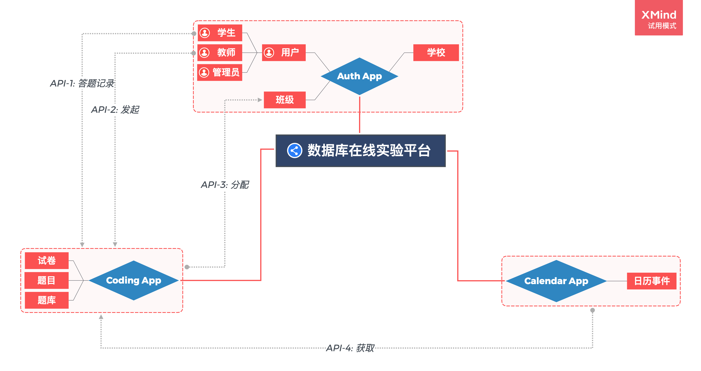
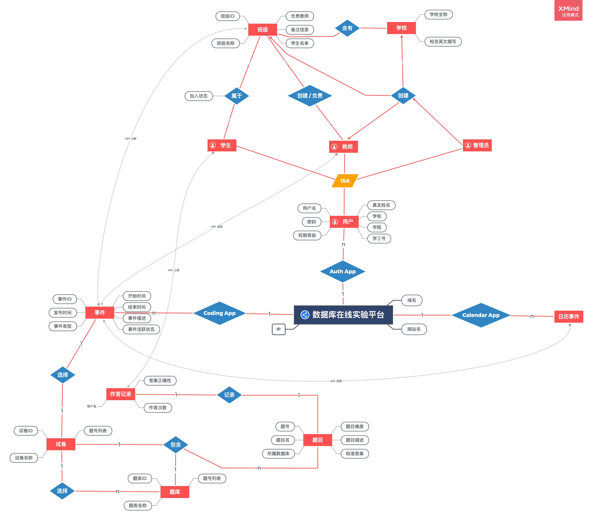

# SQL_memOJi  
DESCRIPTIONS


## Files  
```  
.
├── README.md
├── img
│   ├── Data_Flow.png
│   └── ER.png
├── src
│   ├── SQL_memOJi/
│   ├── user/
│   ├── coding/
│   ├── iCalendar/
│   ├── utils/
│   ├── db.sqlite3
│   └── manage.py
├── static/
└── wiki-zh.md
```  

## Environment
- `env`

## Usage  
- `To be finished.`  


## Installation  
- `To be finished.`  

## TO-DO List
- 前端部分
  - [x] 仪表板
    - [ ] 学生：通过率、最近考试、练习
    - [ ] 老师：已发布的考试、练习、统计信息
  - [x] 统一各页面 `base.html` 部分
    - [x] html
    - [x] django template
      - [x] base.html
      - [x] pages-starter.html
      - [x] index.html
      - [x] iCalendar App/
        - [x] calendar.html
      - [x] User App/
        - [x] auth-login.html
        - [x] auth-register.html
        - [x] auth-recoverpw.html
        - [x] class-manage.html
        - [x] class-details.html
        - [x] user-info.html
      - [x] Coding App/
        - [x] exams-manage.html
        - [x] questions-manage.html
        - [x] coding.html
        - [x] coding-editor.html
        - [x] statistics.html
    - [x] title

  - [x] 账号认证
    - [x] 登录
    - [x] 找回密码
    - [x] 注册
      - [ ] `auth-register.html` 实现分步表单注册
      - [ ] form validation

  - [x] 日历 `calendar.html`
  - [x] 统计数据 `statistics.html`
    - [ ] 学生：已通过/未通过
    - [ ] 老师：练习/考试 已完成/未完成，通过率
  - [x] 个人信息 `user-info.html`
  - [x] 答题 `coding.html`
    - [ ] 编辑器 `coding-editor.html`
    - [ ] 取消“已完成”列，整合到考试、练习中
  - [x] 练习 & 考试 `exams-manage.html`
    - [ ] 练习详情编辑 `modal`
    - [ ] 考试详情编辑 `modal`
    - [ ] 顶部卡片: 下一场练习、暂无考试
    - [ ] 删除/终止考试
  - [x] 班级管理 `class-manage.html`
    - [ ] 学生信息编辑
    - [ ] 班级列表卡片式+列表
    - [ ] 负责老师默认是自己
    - [ ] 列表隐藏邮箱、班级
  - [x] 题库 & 试卷 `questions-manage.html`
    - [x] 题目描述省略多余信息
    - [x] 题目详情编辑
      - [ ] 正确答案
    - [ ] 试卷详情编辑
    - [ ] 创建题库（可选项）
    - [ ] 二级菜单
    - [ ] 取消垃圾箱
    - [ ] 批量管理工具栏
    - [ ] 题目类型（选择/判断/SQL）


- Django 后端
  - [ ] 登录页面
    - [x] 登录功能
    - [x] 登出功能
    - [x] 登录页前端连接
    - [ ] 注册页前端连接
  - [ ] 个人信息页面

- [x] 数据模型
- [x] 数据字典
- [x] ER图
- [x] 数据流图
- [x] API数据定义
- [x] 页面描述
- [x] 功能设计文档(架构)
- [ ] 类图(包图、组件图、UML，继承关系)（实现）
- [ ] 拓展功能:利用模式挖掘等技术，自动总结学生提交 SQL 中的错误使用模式

## 数据模型
> App 指 Django App, 用于分离各项功能  
> **粗体** 表示 **主键**  
> *FK* 表示本 App 模型中的 **外键 (Foreign Key)**  
> *`API`* 表示通过 API 或 Session 获取其他 App 的数据, 从而实现 **“高内聚, 低耦合”**  

### 1. `auth` 模块
> 用户认证 App
- [ ] 学校 `School` (**学校ID**, 学校全称, 校名英文缩写)
- [ ] 用户 `User` (**邮箱**, 密码, 权限等级, 学校(*FK: 学校.学校ID*), 真实姓名, 学工号, 学院, 班级ID(*FK: 班级.班级ID*, NULL), 加入状态, 注册时间)
- [ ] 班级 `Classroom` (**班级ID**, 学校(*FK: 学校.学校ID*), 班级名称, 负责教师(*FK: 用户.真实姓名*), 备注信息, 学生名单)
<!-- - [ ] 班级-学生 `Class_Stud` (班级ID(*FK: 班级.班级ID*), 学工号(*FK: 用户.学工号*), 姓名(*FK: 用户.真实姓名*), 学院(*FK: 用户.学院*), 加入状态) -->

### 2. `coding` 模块
> 答题 App
- [ ] 题目 `Question` (**题目ID**, 题目名, 题库ID(*FK: 题库ID*), 题目难度, 题目描述, 标准答案)
- [ ] 题库 `QuestionSet` (**题库ID**, 题库名称, 题库描述, 创建SQL)
- [ ] 试卷 `Paper` (**试卷ID**, 试卷名称, 试卷类型, 发布时间, 开始时间, 结束时间, 活跃状态, 试卷描述, 发起人(*`API`: 用户.邮箱*), (*视图: 题目ID列表*))
- [ ] 试卷-题目 `Paper_Ques` (试卷ID(*FK: 试卷.试卷ID*), 题目ID(*FK: 题目.题目ID*))
- [ ] 班级-试卷 `Class_Paper` (参与班级(*`API`: 班级.班级ID*), 试卷ID(*FK: 试卷.试卷ID*))
- [ ] 作答记录 `AnswerRec` (邮箱(*`API`: 用户.邮箱*), 题目ID(*FK: 题目.题目ID*), 答案正确性, 作答次数)

### 3. `calendar` 模块
> 日历 App, 无数据表, 使用 `coding.Class_Paper` 的 API

## 数据字典
> PRI - 主键约束  
> UNI - 唯一约束  
> MUL - 可重复  
> NULL - 可以为空  

### 1. `auth` 模块
> 用户认证 App

- [ ] 用户 `User` (**邮箱**, 密码, 权限等级, 学校(*FK: 学校.学校ID*), 真实姓名, 学工号, 学院, 班级ID(*FK: 班级.班级ID*, NULL), 加入状态, 注册时间)

| 字段名                | 数据类型            | 非空 | Key | 默认值      |
|-----------------------|---------------------|------|-----|-------------|
| email                 | varchar             |      | PRI |             |
| password              | varchar             |      |     |             |
| priority              | int                 |      |     | 0           |
| school_name           | varchar             |      | FK  | 西北工业大学|
| full_name             | varchar             |      |     |             |
| internal_id           | varchar             |      | UNI |             |
| college_name          | varchar             |      |     |             |
| class_id              | varchar             |      | FK  |             |
| join_status           | int                 |      |     |             |
| register_time         | datetime            |      |     |             |

- [ ] 学校 `School` (**学校ID**, 学校全称, 校名英文缩写)

| 字段名                | 数据类型            | 非空 | Key | 默认值      |
|-----------------------|---------------------|------|-----|-------------|
| school_id             | varchar             |      | PRI |             |
| school_name           | varchar             |      | UNI |             |
| school_abbr           | varchar             |      | UNI | NPU         |

- [ ] 班级 `Classroom` (**班级ID**, 学校(*FK: 学校.学校ID*), 班级名称, 负责教师(*FK: 用户.真实姓名*), 备注信息, 学生名单)

| 字段名                | 数据类型            | 非空 | Key | 默认值      |
|-----------------------|---------------------|------|------|------------|
| class_id              | varchar             |      | PRI  |            |
| school_id             | varchar             |      | FK   |            |
| class_name            | varchar             |      |      |            |
| teacher_name          | varchar             |      | FK   |            |
| class_desc            | varchar             |      | NULL |            |
| stud_list             | varchar(Python.List)|      |      |            |


### 2. `coding` 模块
> 答题 App
- [ ] 题目 `Question` (**题目ID**, 题目名, 题库ID(*FK: 题库ID*), 题目难度, 题目描述, 标准答案)

| 字段名                | 数据类型            | 非空 | Key | 默认值      |
|-----------------------|---------------------|------|-----|-------------|
| ques_id               | varchar             |      | PRI |             |
| ques_name             | varchar             | NULL |     |             |
| ques_set_id           | varchar             |      | FK  |             |
| ques_difficulty       | int                 | NULL |     |             |
| ques_desc             | varchar             | NULL |     |             |
| ques_ans              | varchar             |      |     |             |


- [ ] 题库 `QuestionSet` (**题库ID**, 题库名称, 题库描述, 创建SQL)

| 字段名                | 数据类型            | 非空 | Key | 默认值      |
|-----------------------|---------------------|------|-----|-------------|
| ques_set_id           | varchar             |      | PRI |             |
| ques_set_name         | varchar             |      |     |             |
| ques_set_desc         | varchar             |      |     |             |
| create_sql            | varchar             |      |     |             |


- [ ] 试卷 `Paper` (**试卷ID**, 试卷名称, 试卷类型, 发布时间, 开始时间, 结束时间, 活跃状态, 试卷描述, 发起人(*`API`: 用户.邮箱*), (*视图: 题目ID列表*))

| 字段名                | 数据类型            | 非空 | Key | 默认值      |
|-----------------------|---------------------|------|-----|-------------|
| paper_id              | varchar             |      | PRI |             |
| paper_name            | varchar             |      |     |             |
| paper_type            | int                 |      |     |             |
| publish_time          | datetime            |      |     |             |
| start_time            | datetime            |      |     |             |
| end_time              | datetime            |      |     |             |
| paper_active          | bool                |      |     | True        |
| paper_desc            | varchar             |      |     |             |
| initiator             | varchar             |      | API |             |


- [ ] 试卷-题目 `Paper_Ques` (试卷ID(*FK: 试卷.试卷ID*), 题目ID(*FK: 题目.题目ID*))

| 字段名                | 数据类型            | 非空 | Key | 默认值      |
|-----------------------|---------------------|------|-----|-------------|
| paper_id              | varchar             |      | FK  |             |
| ques_id               | varchar             |      | FK  |             |


- [ ] 班级-试卷 `Class_Paper` (参与班级(*`API`: 班级.班级ID*), 试卷ID(*FK: 试卷.试卷ID*))

| 字段名                | 数据类型            | 非空 | Key | 默认值      |
|-----------------------|---------------------|------|-----|-------------|
| class_id              | varchar             |      | API |             |
| paper_id              | varchar             |      | FK  |             |


- [ ] 作答记录 `AnswerRec` (邮箱(*`API`: 用户.邮箱*), 题目ID(*FK: 题目.题目ID*), 答案正确性, 作答次数)

| 字段名                | 数据类型            | 非空 | Key | 默认值      |
|-----------------------|---------------------|------|-----|-------------|
| email                 | varchar             |      | API |             |
| ques_id               | varchar             |      | FK  |             |
| ans_status            | bool                |      |     | False       |
| submit_cnt            | int                 |      |     | 0           |


## 数据流图


```json
API_1 = {
  "email": email,
  "ques_id": ques_id,
  "ans_status": ans_status,
  // submit_cnt += 1
}

// Paper
API_2 = {
  "paper_id": paper_id,
  "paper_name": paper_name,
  "paper_type": paper_type,
  "start_time": start_time,
  "end_time": end_time,
  "paper_active": paper_active,
  "paper_desc": paper_desc,
  "initiator": session[email],
}

API_3 = {
  "class_id": class_id,
  "paper_id": paper_id,
}

API_4 = {
  "class_id": class_id,
  "paper_id": paper_id,
  "paper_name": paper_name,
  "paper_type": paper_type,
  "start_time": start_time,
  "end_time": end_time,
  "paper_active": paper_active,
  "paper_desc": paper_desc,
  "initiator": session[email],
}
```

## ER图


---  
**Developed by [Steve X](https://github.com/Steve-Xyh/SQL_memOJi)**
