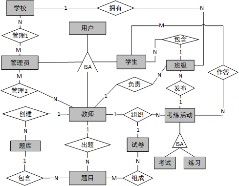

# SQL_OJ  
## DESCRIPTIONS
A Online-Judge Platform for NWPU DataBase Course.

**Developed by [Steve X](https://github.com/Steve-Xyh/)**
**Modified by [Seddon Shen](https://github.com/SeddonShen/)**

## File Structure  代码结构
```  
.
├── README.md
├── DataExplain.md
├── img
│   ├── Data_Flow.png
│   └── ER.png
├── src
│   ├── SQL_memOJi/
│   ├── user/
│   ├── coding/
│   ├── iCalendar/
│   ├── utils/
│   └── manage.py
├── static/
├── wiki-zh.md
└── 生产环境部署.md
```  

## Function 软件功能
- __`学生端`__:
    - `个人仪表盘`：
      - 提交统计信息：总提交次数、提交记录（7日提交数、30日提交数）
      - 考练统计信息：考试数量、练习数量、考试成绩分析、练习成绩分析、作答题目难度分布
      - 详细列表：已作答测试列表（测试名、时间、得分、错题数等）
    - `答题-卡片列表`：下一场考试、已完成考试列表、已完成练习列表
    - `答题-考练题目`：左侧：题目要求；右侧：答题编辑框
    - `个人信息`：学生信息
    - `日历` ：考试和练习日历


- __`教师端`__
    - `数据中心`
      - `班级数据`
        - 班级成绩数据：所有班级的卡片式列表
        - 某个班级信息：该班级所有测试列表（名称、发布时间、截止时间、开始人数、完成人数、完成率、正确率、详情）
        - 某次考试信息：支持各种数据的显示和导出，具体包括题目作答情况、未完成学生列表、有错题学生列表（含具体错题信息）、成绩；
      - `统计数据`
        - 考试/练习完成情况：统计已完成\未完成人数、优秀\良好\及格\不及格人数占比
        - 题目作答情况：统计每道题平均正确率、平均完成率、平均提交次数
        - TODO: 目前统计仅支持所有班级的分析，后续期望支持按照班级的统计


- __`Django 后端`__（管理端：支持各种数据的管理）
  - `USER`
    - 学校管理
    - 学生
    - 学生清单: 支持导入和导出，显示所有应参加考练的学生信息（姓名、学号、班级、班级识别码、加入状态）
    - 教师
    - 班级
    - 用户
  - `CODING`
    - 练习
    - 练习作答记录
    - 考试
    - 考试作答记录
    - 试卷
    - 题库
    - 题目
    - 题目作答记录（练习）
    - 题目作答记录（考试）

- TODO: 利用模式挖掘等技术，自动总结学生提交SQL中的错误使用模式
- 详细介绍参考：`wiki-zh.md`
- 统计功能中的数据说明参考：`DataExplain.md`

## Environment & Installation 环境与安装 
- 参考：`Install.md`
- 参考：`生产环境部署.md`

## Data Flow Diagram 数据流图


## ER图


## 数据模型与数据字典
> App 指 Django App, 用于分离各项功能  
> **粗体** 表示 **主键**  
> *FK* 表示本 App 模型中的 **外键 (Foreign Key)**  
> *`API`* 表示通过 API 或 Session 获取其他 App 的数据, 从而实现 **“高内聚, 低耦合”**  

### 数据模型
1. `user` 
2. `coding` 
详情待补充

### 数据字典
> PRI - 主键约束  
> UNI - 唯一约束  
> MUL - 可重复  
> NULL - 可以为空  

详情待补充

---  
**Developed by [Steve X](https://github.com/Steve-Xyh/SQL_memOJi)**
**Modified by [Seddon Shen](https://github.com/SeddonShen/SQL_memOJi)**

